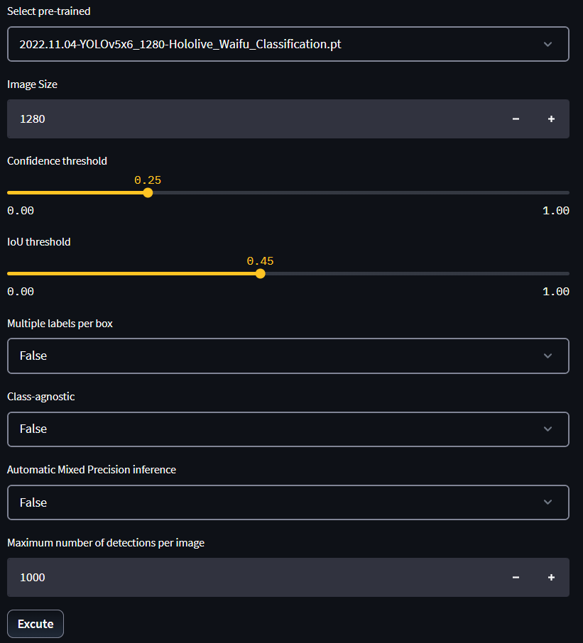
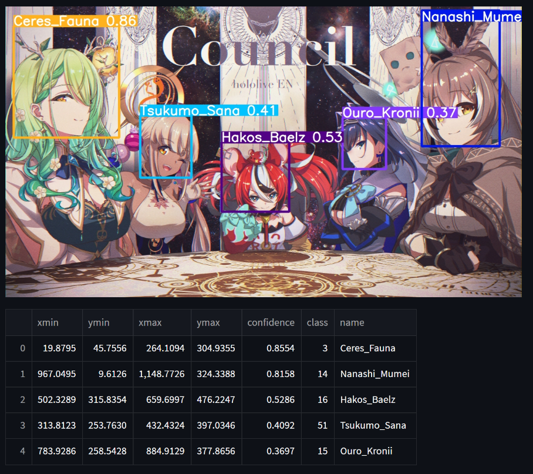

# YOLOv5-Hololive_Waifu_Classification

Detects Hololive VTubers in images with YOLOv5 and names each one (58 classes). Demo: [Hugging Face Space](https://huggingface.co/spaces/neko941/YOLOv5-Hololive_Waifu_Classification).

<p align="center">
  <br>
  <br>
  <em>Hololive Waifu Classification Web Application (Figure 18 of the <a href="report/HololiveDetectionReport.pdf">report</a>)</em>
</p>

## Layout

| Path | Contents |
|------|----------|
| `app.py` | Streamlit demo (same as the Space; loads models from `pretrained/hololive_2/<date>/`) |
| `pretrained/` | trained models by date: `hololive_2/` (character classes), `anime_head/` (one `anime_head` class) |
| `dataset/images/` | 3,810 images shared by every label set |
| `dataset/label_hololive_1/`, `label_hololive_2/` | YOLO labels, first and revised pass (same 58 classes, 1,140 boxes redrawn in the revision) |
| `dataset/label_anime_head/` | head boxes, single class |
| `dataset/unlabled/` | images not yet labelled, per character |
| `tools/` | dataset scripts (renaming, duplicate check, label stats) |
| `report/` | project report: PDF and its LaTeX source |
| `docs/` | README figures (from the report) |

`dataset/`, `pretrained/` and `*.pt` are git-ignored (about 19 GB).

## Citation

If you use this dataset, models or code, please cite the report:

> Khoa Nguyen, Khoi N. A. Hoang, and Hung D. Hoang. *Hololive Waifu Classification using YOLOv5*. Technical report, Computer Science Engineering, Vietnamese-German University, 2023. [PDF](report/HololiveDetectionReport.pdf)

```bibtex
@techreport{nguyen2023hololive,
  title       = {Hololive Waifu Classification using {YOLOv5}},
  author      = {Nguyen, Khoa and Hoang, Khoi N. A. and Hoang, Hung D.},
  institution = {Vietnamese-German University},
  type        = {Elective subject project report},
  year        = {2023},
  url         = {https://github.com/neko941/YOLOv5-Hololive_Waifu_Classification}
}
```
